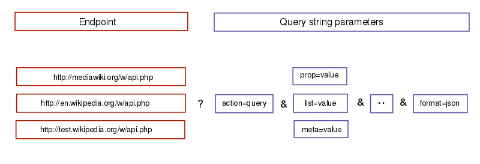

# WikiRaces

This project was generated with [Angular CLI](https://github.com/angular/angular-cli) version 7.3.0.

### What's a Wiki Race?

[well let me tell you....](https://en.wikipedia.org/wiki/Wikipedia:Wikirace)


## Authors
Christopher Cahill &&
Ryan Leslie &&
Quinn Miller


### notes

here are some notes on

```html
<apiCallExamples>
https://en.wikipedia.org/w/api.php?action=query&list=search&srsearch=Bill%20Gates&format=json

https://en.wikipedia.org/w/api.php?action=query&list=search&srsearch=Bill%20Gates&format=jsonfm
</apiCallExamples>
```

```html
<someOtherLinks>
  https://en.wikipedia.org/w/api.php
  https://www.mediawiki.org/wiki/API:Errors_and_warnings
  https://en.wikipedia.org/wiki/Special:ApiSandbox#action=help&recursivesubmodules=1
  https://www.mediawiki.org/wiki/API:Tutorial
</someOtherLinks>

```
```html
<rest API >
https://en.wikipedia.org/api/rest_v1/

http://listen.hatnote.com/
```



